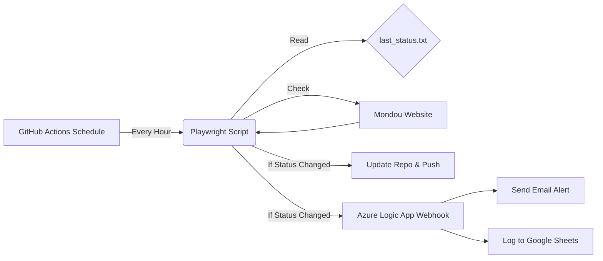

# 🐱 Mondou Stock Monitor

A "Smart" automated stock tracking system for Mondou pet products. This bot checks stock status hourly, maintains state to prevent spam, alerts via Email upon changes, and logs history to Google Sheets for pattern analysis.

## 🚀 How It Works

1.  **Check:** GitHub Actions runs a Playwright script every hour.
2.  **Compare:** The script reads `last_status.txt` to see if the stock status has changed since the last run.
3.  **Act (If Changed):**
    * **Updates** the repository with the new status.
    * **Notifies** an Azure Logic App via Webhook.
4.  **Distribute:** Azure sends an email alert and appends the data to a Google Sheet.

### System Architecture



## ✨ Features

* **Smart State Tracking:** "Memory" file ensures alerts are only sent when the status actually changes (In Stock <-> Out of Stock).
* **Real Browser Simulation:** Uses Playwright to simulate a real user clicking "Add to Cart" to verify true availability.
* **Dual Notification:** Instant Email alerts + Long-term Google Sheet logging.
* **Zero Maintenance:** Runs entirely on the cloud (GitHub Actions + Azure Serverless).

## 🛠️ Configuration

### 1. Files
* `check-stock.js`: The main logic script.
* `.github/workflows/stock-check.yml`: The automation scheduler.
* `last_status.txt`: Stores the previous stock state (do not delete).

### 2. Environment Secrets
The workflow relies on the following GitHub Repository Secret:
* `WEBHOOK_URL`: The HTTP POST URL for the Azure Logic App.

## ⚙️ Maintenance

### Changing the Product
To monitor a different product, edit `check-stock.js`:

```javascript
// Line 8
const productUrl = '[https://www.mondou.com/en-CA/your-new-product-url](https://www.mondou.com/en-CA/your-new-product-url)...';
```
### Forcing a Reset
If you want to force the bot to check and alert immediately (regardless of previous state):
1.  Open `last_status.txt`.
2.  Change the text to `RESET`.
3.  Commit the change.
4.  Manually trigger the workflow via the **Actions** tab.

## 🧰 Tech Stack
* **Runtime:** Node.js
* **Browser Automation:** Playwright
* **CI/CD:** GitHub Actions
* **Backend Logic:** Azure Logic Apps
* **Database/Logging:** Google Sheets

---
*Automated by the Mondou Stock Monitor Bot* 🤖